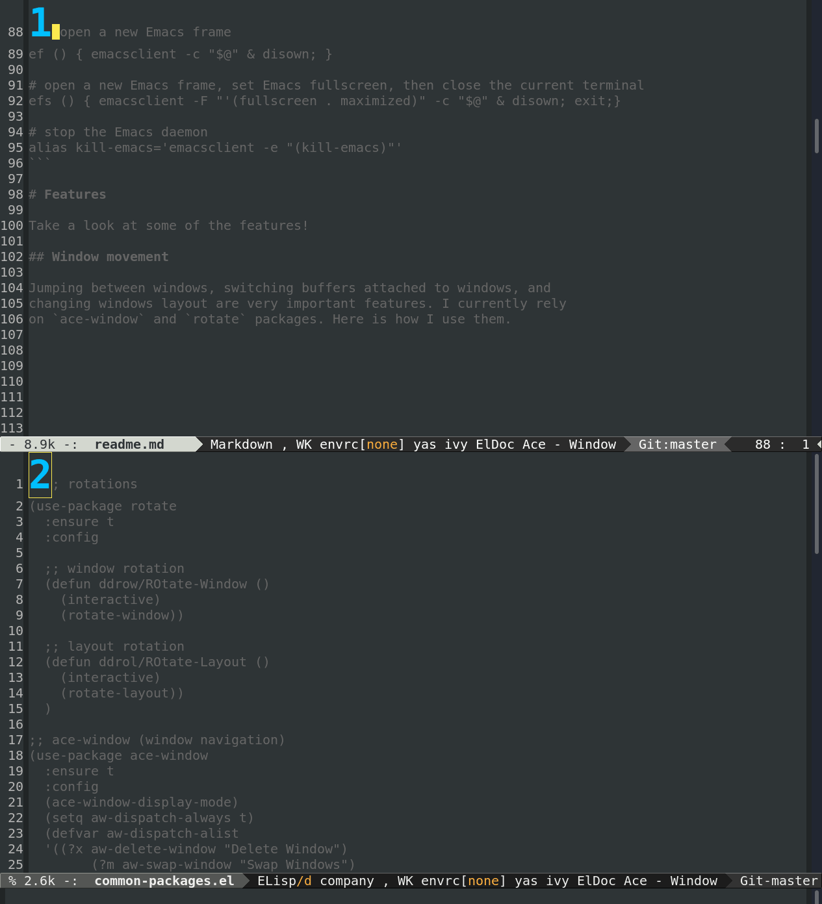
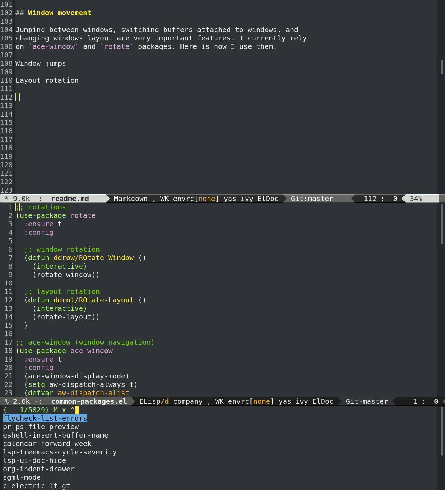
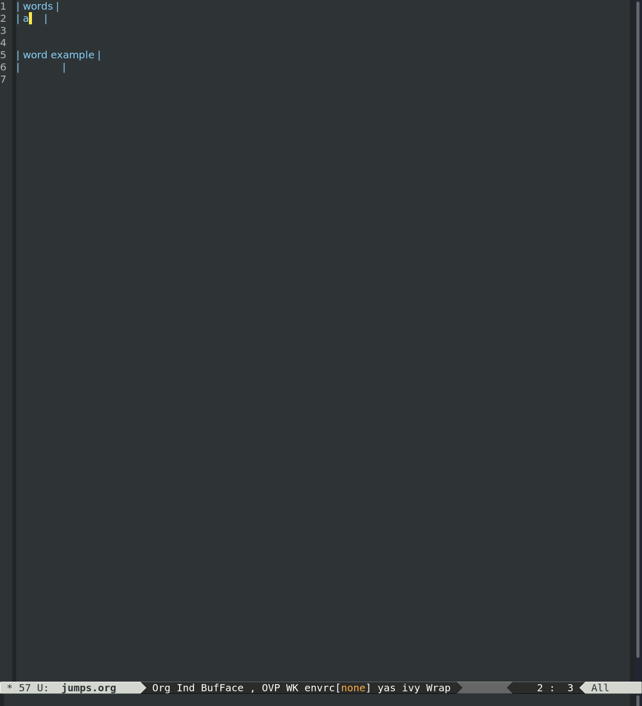
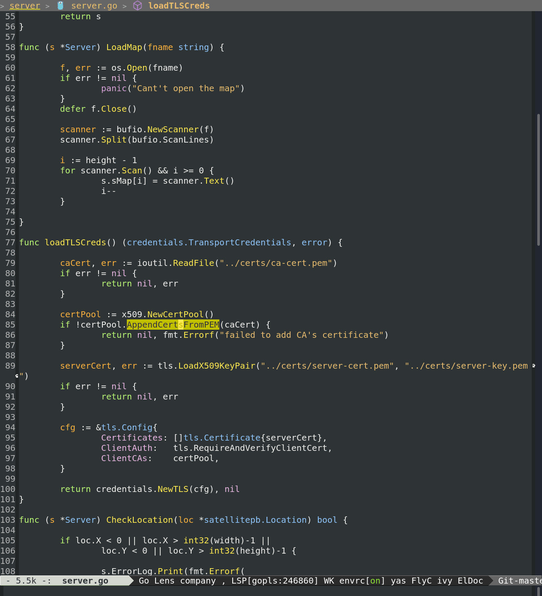
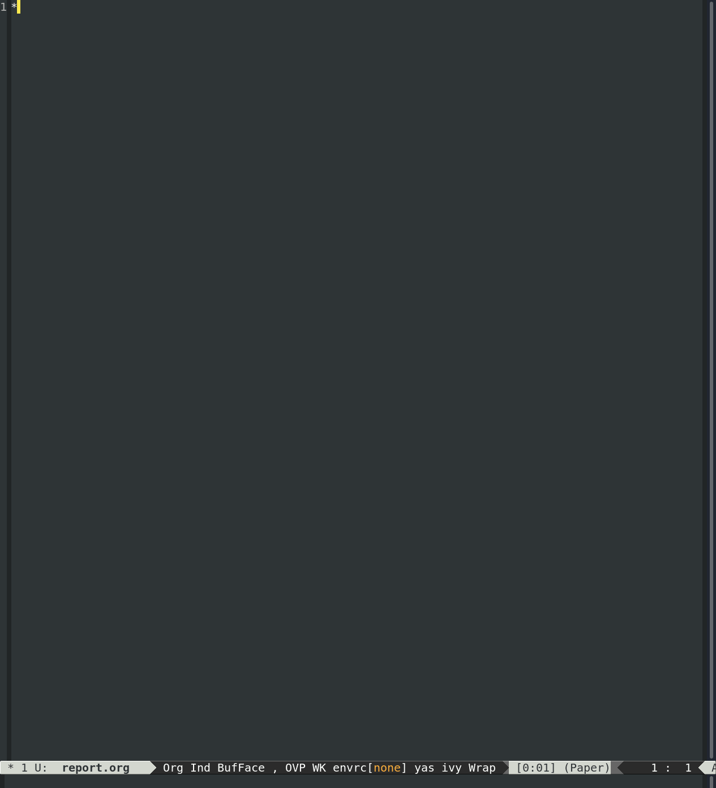

# dot-emacs

My `.emacs.d` configuration files.

TLDR:

+ little Elisp knowledge required
+ `use-package` macros and only packages from melpa
+ Emacs daemon (server) on the background
+ LSP (Bash, C/C++, Go, Javascript, Python, Rust, Typescript)
+ LaTeX support (with latex-extra, AUCTeX)
+ Japanese language support (with mozc)
+ utilize native-comp if available
+ Debian-based OS
+ keybindings optimized for Ergodox EZ layout and Regolith (i3)

**TOC**

+ [Some notes about my setup](#some-notes-about-my-setup)
+ [How I use Emacs](#how-i-use-emacs)
  - [Bash commands](#bash-commands)
+ [Features](#features)
  - [Window Movement](#window-movement)
  - [C/C++](#cpp)
  - [Go](#go)
  - [Javascript and Typescript](#javascript-and-typescript)
  - [Python](#python)
  - [Rust](#rust)
  - [LaTeX](#latex)
  - [Japanese Input](#japanese-input)
+ [Q&A](#questions-and-answers)


# Some notes about my setup

I mostly spend my day between Chrome, an Emacs frame, and a bash
terminal.

There are four **reasons why I use Emacs**:

+ setup shared across separate machines,
+ no need to interact with the mouse,
+ distraction-free (or focused) editing,
+ high productivity independently to the task (writing, coding,
   activity planning, studying).
   
I prefer having a **minimal** and easy to use **configuration**, and I
tend to avoid changing it while working (although playing with Emacs
is super fun!). Most of the improvements are made on the days off. So,
new features are introduced only if when they are really needed.

# How I use Emacs

Everyday, I **start Emacs** on the background right after boot typing
`sem` in the terminal (see [here](#bash-functons)). On my machine this
takes ~2/3 seconds.

There are two options to edit a file:

+ `sem <PATH_NAME>` to open the file with Emacs in a new frame,
+ `semt <PATH_NAME>` to open the file in with Emacs in the terminal window.

To **stop Emacs** from running in the background, I run `kim`.
  
There are ways I update my Emacs configuration:

1. if it's just something I want to tweak right on the spot, I open a
   new buffer, type some Elisp and then call `eval-region`. These are
   modifications that do not persist with a restart of the daemon,
2. if it's something more complex, I edit and save the dotfiles, then
   restart the daemon running with `kim; sem`.
  
## Bash functions

Add the following at the end of your `.bashrc`

```bash
# start emacs daemon
sem_start(){
    local sem_echo=$(emacsclient -a false -e 't' 2>/dev/null)
    if [[ $sem_echo != "t" ]]; then
		# start emacs daemon
		$(emacs --daemon)
		local sem_initialized=1
    fi
    if [ -z $sem_initialized ]; then
		if [[ $# -eq 0 ]] ; then
			echo "serving"
		fi
	fi
}

# start emacs daemon and open filename if argument is provided
sem(){
	if [[ $# -eq 0 ]] ; then
		sem_start
	else
		sem_start "silence"
		emacsclient -c $1 & disown
	fi
}

# start emacs daemon and open filename in the terminal window if argument is provided
semt(){
	if [[ $# -eq 0 ]] ; then
		sem_start
	else
		sem_start "silence"
		emacsclient -nw $1
	fi
}

# kill emacs daemon
kim(){
	emacsclient -e "(kill-emacs)"
}
```

# Features

Take a look at some of the features, and don't forget to peek the Q&A!

## Window movement

Jumping between windows, switching buffers attached to windows,
changing windows layout, jumping to previous points are very important
features. I currently rely on `ace-window` and `rotate` packages. 

Here is how I use them.

Window jumps: `M-o 2`



Layout rotation: `ddrol` + `Enter`, then `C-x z`



A couple of functions based on registers: `C-<f7>` and `M-<f7>` 



## Cpp

Tips:

+ Install `clang` and `clangd` on the system
+ Verify installation evaluating `(executable-find "clangd")`
+ Configure the file `compile_commands.json` in the root of your
  project
+ See the sources to get more hints
+ Default style set to `linux`

## Go

Tips:

+ Install the `gopls` language server with `go install
  golang.org/x/tools/gopls@latest`
+ Add the go binary to the `PATH` and to the list of executables
  `exec-path`
+ Setup hooks as explained
  [here](https://github.com/golang/tools/blob/master/gopls/doc/emacs.md)
  
Example of jump to definition using LSP: `S-l g g`, then `M-,` to jump back



## Javascript and Typescript

Tips:

+ Install the `Deno` runtime (see [here](https://deno.land/#installation))
+ `Deno` already ships with a language server, a linter, and a
  formatter
+ Use a `tsconfig.json` to enable additional options

## Python

Tips:

+ Install `direnv` to your host (so that you can use virtual environments)
+ Add an `.envrc` to your project and use a python layout
+ Install `isort` and `yapf` with `pip` to automatically sort import
  definitions and format code
+ Open a `.py` file; `lsp-pyright` automatically installs the language
  server if not available (this is currently done via Node.js)
+ Look [here](https://github.com/purcell/envrc) if you need to work
  with multiple virtual environments at the same time
  
## Rust

Tips:

+ Add standard library code to your toolchain with `rustup component
  add rust-src`
+ Install `rust-analyzer` or `rls`
+ You can use `rustfmt` as formatter

## LaTeX

Tips:

I don't use LSP for LaTeX, as
[AUCTeX](https://www.gnu.org/software/auctex/) works smoothly.

When you work on a complex document split across many source files,
you can use variables to set up the environment (see
[here](https://www.gnu.org/software/auctex/manual/auctex.html#Multifile)).
This will allow you to run `TeX-command-master` and `TeX-view` from
any of the source files.

Example of environment configuration

```
%%% Local Variables: 
%%% mode: latex
%%% TeX-master: "../../../main.tex"
%%% reftex-default-bibliography: "../../../bib/biblio.bib"
%%% End:
```

## Japanese Input

Tips:

+ Install Japanese language support on your system
+ Install the `emacs-mozc` program

Example of taking notes in Japanese and English with Org mode: toggle
English/Japanese with `<f7>`



# Questions and Answers

I find this setup very practical. In the following there is list of
considerations and remarks that may be useful.

+ How much **time** does it take to get used to Emacs? If you are
  thinking about getting started with Emacs, don't worry too much
  about the time investment (it should take ~2 weeks to get used to
  how it works). Try to stick to the default keybindings (you will
  understand the reason later). Try to use vanilla Emacs (which is
  indeed very powerful). You don't need Elisp to be productive. Try to
  adjust your configuration progressively, and apply little changes
  when you need it. Using Emacs is rewarding.

+ Why using a **daemon** and not separate Emacs instances? Packages
  are loaded only once, subsequent operations are instantaneous.

+ Why `use-package`? It is super easy to use, and it permits to keep
  the files tidy and readable. There are powerful alternatives as
  `straight.el`, but I don't feel the need to use a package manager
  yet.

+ Why the first boot is _slower_? The first time Emacs is started all
  the package archives are fetched, then the packages are compiled and
  loaded.

+ Do you only use packages from **melpa** and melpa-stable? Yes. When
  I work on a new machine (or a VM) the setup boils down to creating a
  symbolic link to my dotfiles and then run the command `sem`.
  
+ Why `package-native-compile`? Coding inside a VM with `lsp` is a bit
  laggy (especially with Rust). Compiling and installing Emacs with
  native compilation enabled significantly improves the experience. If
  native compilation is available, `package-native-compile` tells the
  built-in package manager to perform native compilation when
  installing a package.
  
+ Do you always use Emacs instead of **IDEs**? Yes, up to now there
  has been only one exception: Android. AOSP indexing takes a lot of
  time (Emacs may freeze). Also, app development with Android Studio
  is easier.
  
+ What about **LSP configuration**? I tend to rely only on LSP basic
  functions (again, without changing the default keybindings). In
  general, I think that language-specific command line tools are more
  convenient when there is the need to trace, inspect or debug a
  project. These tools can be neatly arranged into Makefiles recipes,
  making it easy to reproduce the tests on different hosts, by
  different devs, and with different setups.
  
+ Why LSP over **Eglot**? No strong preference. A while ago LSP was
  easier to setup and provided more functions. Since I don't need all
  of them to be productive, I think I will try out Eglot after it will
  be merged into Emacs.
  
+ Why **Regolith**? Barely no setup cost, and when you need something
  more advanced, you can directly edit the i3 configuration. I used to
  be an **EXWM** user. The daily experience was incredible, but from
  time to time it required to stop my activies, making me feel a bit
  unproductive. I no longer have the same integration I had with EXWM,
  but in case of problem (or when Emacs freezes), I can just do a
  `kim; sem` to kill and restart the server instead of the whole
  session.

+ Some **commands** do not work. There are Emacs packages that rely on
  external binaries that need to be available on the host (e.g.,
  direnv). In these cases, I just ensure there are no errors at boot
  time (Emacs installation or startup must not fail even when a binary
  isn't available). You can find the relevant `prerequisite(s)` in the
  comments.

+ **Updates**? I plan to update this public version of the
  configuration files from time to time.  There are many packages that
  I would like to use in the future, but there is no reason to rush
  and install them now.
  
+ Some **keybindings** seem unnatural. That's because I use a split
[Ergodox EZ](https://ergodox-ez.com/) with a custom layout. 
